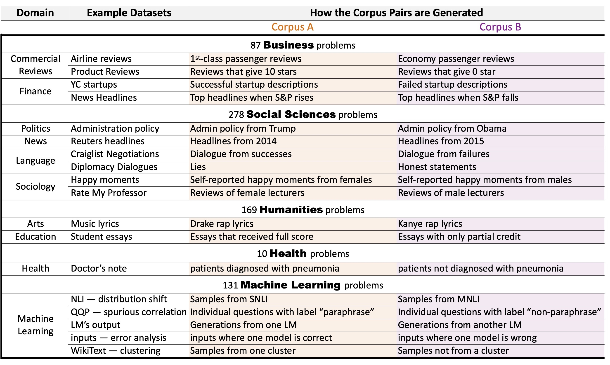

OpenD5
===

Authors: Ruiqi Zhong, Peter Zhang, Steve Li, JinWoo Ahn, Dan Klein, Jacob Steinhardt

[Paper link](https://arxiv.org/pdf/2302.14233.pdf)

This repository hosts OpenD5, a benchmark for discovering natural language facts from pairs of corpora. Our paper focuses on the setting comparing two distributions of text via a text description. The repository containing the system is available [here](https://github.com/ruiqi-zhong/D5).


The benchmark spans a wide array of disciplines and problem types. A sibling repostiory that contains code for running our system for solving these problems is available [here](https://github.com/ruiqi-zhong/D5).



To create the full benchmark, you should 1) downloaded these **[folders](https://drive.google.com/drive/folders/18N7-cwpXVtat9CocrMn_y7aI6Sbyo-Hn?usp=share_link)** and 2) run the [`build_benchmark.sh`](scripts/build_benchmark.sh) script from the main repo.

For more details, please refer to the
- [instructions](scripts/README.md) for using the scripts
- [explanations](schema/README.md) of the relevant schema

# Downloads

- The 675 problems in the original paper are available [**here**](https://doi.org/10.5281/zenodo.7662705).
- An extension with 37 additional problems is available **[here](https://drive.google.com/file/d/1meT_ewZrHRZM_VcAMos3eWHSYIMnlLED/view?usp=sharing)**.
- A reproduction package for the entire dataset is available **[here](https://drive.google.com/drive/folders/18N7-cwpXVtat9CocrMn_y7aI6Sbyo-Hn?usp=share_link)**. It includes additional source data that is required to assemble the full dataset.

# Contributing

If you'd like to contribute additonal problems to the benchmark, please:
- Create a script for constructing various splits for the dataset (see [`pull_data.py`](scripts/pull_data.py)).
- Add the dataset's relevant metadata to the [`datasets.yaml`](schema/datasets.yaml) and [`pairs.yaml`](schema/pairs.yaml) schema.
- Create a pull request and list the relevant citation.
- Email petez@berkeley.edu with any questions.

# BibTeX

```bibtex
@article{zhong2023goal,
  title={Goal Driven Discovery of Distributional Differences via Language Descriptions},
  author={Zhong, Ruiqi and Zhang, Peter and Li, Steve and Ahn, Jinwoo and Klein, Dan and Steinhardt, Jacob},
  journal={arXiv preprint arXiv:2302.14233},
  year={2023}
}
```
