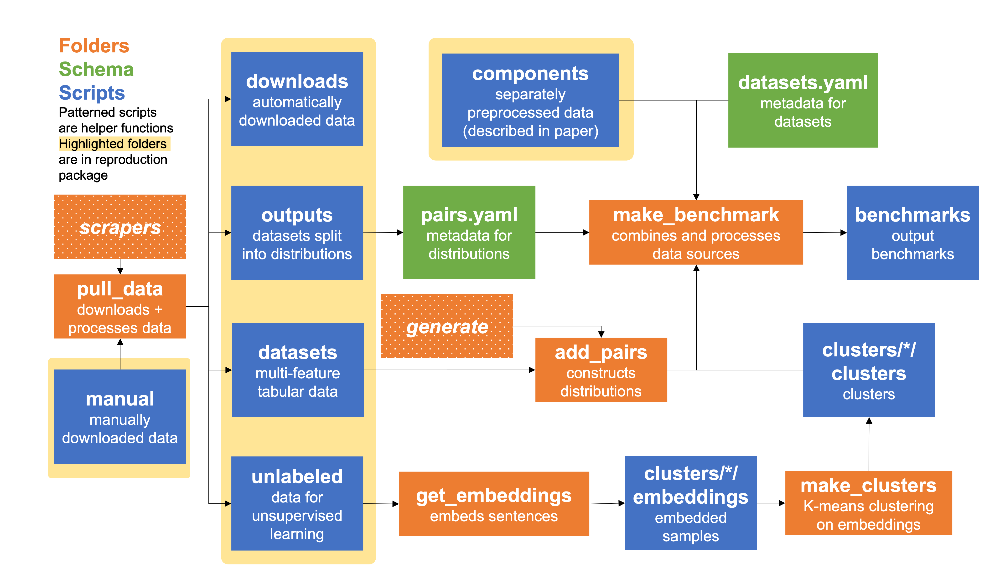

OpenD5 Scripts
=== 

Most of the existing intermediary files have been removed from GitHub and instead are available from this [reproduction package](https://drive.google.com/drive/u/0/folders/18N7-cwpXVtat9CocrMn_y7aI6Sbyo-Hn). Please move all folders to the repo before re-running scripts below: `clusters`, `dataset`, `downloads`, `manual`, `output`.

You can generate the benchmark with accessible datasets using the `build_benchmark.sh` script.

All folder names are arbitrary and can be modified in the [`parameters.py`](parameters.py) script.

Be sure to create the associated conda environment from the `environment.yml` file in the main repo using:

`conda env create --file environment.yml -n opend5`

# Pulling Data

The [`pull_data.py`](pull_data.py) script contains individual functions for each dataset in the benchmark. Each function has one of three methods for obtaining data:
1. **Download**: It downloads and leaves mostly intact a mirror of an existing dataset. Datasets are variously downloaded from GitHub repositories, Zenodo, Harvard Dataverse, sites hosted by authors, and other sources of reproduction material.
2. **Scrape**: Some datasets (e.g. [`open_review`](scrape_open_review.py) or [`admin_statemnts`](scrape_admin_statements.py)) are constructed by collecting data from an API or crawler. These datasets should be separated into separate scripts beginning with `scrape`.
3. **Manual**: For datasets without an easily accessible URL, source files are downloaded manually. The respective function should directly preprocess the downloaded dataset.

By default, manually downloaded datasets should be located in the `manual` folder under a subdirectory with the dataset's name. Automatically downloaded datasets should have a copy saved to the `downloads` folder (to preserve reproducibility). All formatted datasets should be outputted to the `outputs` folder.

To generate just the datasets that are accessible but not licensed for sharing, use `pull_data.py --access`. To retrieve data from Twitter, get a valid [API key](https://developer.twitter.com/en/products/twitter-api/academic-research) and add it to the relevant scripts (`scrape_twitter_rumors.py` and `scrape_blm_countermovements.py`). You should then set the `status` field of these datasets in [`datasets.yaml`](../schema/datasets.yaml) to `accessible`.

# Automated Generation

Some tasks in the benchmark are generated automatically at scale from large datasets. [`generate.py`](generate.py) contains helper functions for doing this. Functionalities include:
- For **categorical** features, contrasting each label with every label or creating every label-to-label pair.
- For **discrete** features, pairing labels *step-wise* (i.e. 1 with 2, 2 with 3, etc.)

For example usage, reference the [`add_pairs.py`](add_pairs.py) script, which should also hold any of your automatically generated pairs. Datasets should be stored in tabular form in the `datasets` folder.

# Clusters

Several of the D5 tasks are clusters generated from large corpora. We store these unlabeled collections of text in the `unlabeled` folder. [`get_embeddings.py`](get_embeddings.py) embeds the text and [`create_cluster.py`](create_cluster.py) uses those embeddings to create K-means clusters.

# Assembly

[`make_benchmark.py`](make_benchmark.py) aggregates the full benchmark. If everything is set up properly running the following command (from the main repo) should generate the full benchmark in the [`benchmarks`](../benchmarks) folder: `python scripts/make_benchmark.py --full`

# Utils
- [`utils.py`](utils.py) contains helper functions that are used throughout.
- [`test_discriminative.py`](test_discriminative.py) has weak classifiers which we use to measure problem difficulty.
